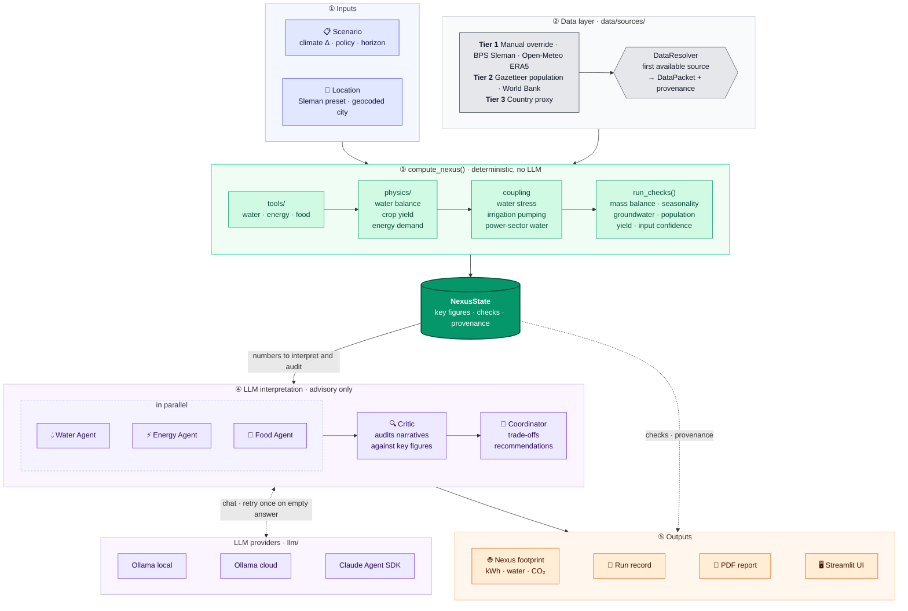
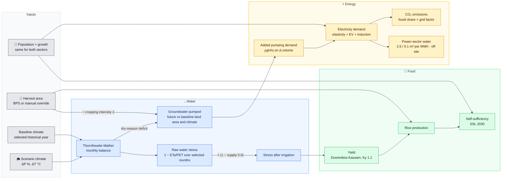
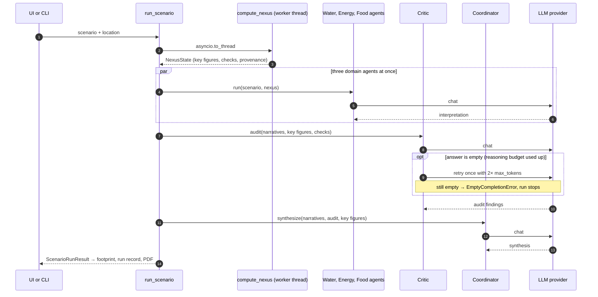

# WEF-Agentic

**A multi-city agentic AI framework for Water-Energy-Food Nexus governance**. It puts the WEF 2026 readiness functions into practice at the sub-national level and tracks the nexus footprint of its own LLM usage.

It puts two WEF 2026 frameworks into practice:

- **WEF (2026a)** *Making Agentic AI Work for Government: A Readiness Framework* (April 2026)
- **WEF (2026b)** *Building Resilient and Scalable AI Value Chains: A Nexus Strategy* (May 2026)

Project specification and Phase 2/3 acceptance criteria: [`WEF-Agentic.md`](WEF-Agentic.md). Session-to-session progress and next steps: [`PROGRESS.md`](PROGRESS.md).

> **Status:** Phase 1 complete: deterministic nexus coupling × 5 agents × 5 scenarios × multi-city × data sources framework × comparison mode × PDF export × offline test suite + CI.

### Local demo and chapter project

With the project environment installed, run `bash scripts/start_demo.sh` and open
http://127.0.0.1:8501. The demo starts with a recorded Claude analysis and synthetic
climate outputs; it requires no API call to view. Fresh runs use the selected provider.
The [ISTIC book-chapter subproject](subprojects/unesco-book-chapter/README.md) contains
the EOI, chapter outline, exported figures and evidence limits.

Use `python -m wef_agentic.data.bootstrap --force` to replace a synthetic cache with
live climate data. Historical downloads use paced yearly requests. Run all five
deterministic scenarios with `python scripts/run_sweep.py --output result.json`.
Both sweep and scenario scripts accept `--baseline-year 2015` and optional
`--growing-months 6 7 8 9`; the latter example is not a sourced local crop calendar.
For Sobol analysis install `.[sensitivity]` and use `scripts/run_sensitivity.py`;
`docs/sensitivity-example.json` contains illustrative, uncalibrated bounds.

---

## ✨ Feature Highlights

| Domain | Capability |
|---|---|
| **Nexus coupling** | Runs deterministically, before any LLM: water balance → water stress → yield; irrigation pumping → electricity demand; electricity demand → power-sector water use. Automatic consistency checks included |
| **Agents** | 5 LLM agents (Water, Energy, Food, Critic, Coordinator) that *interpret* model results. Tools run in a scripted pipeline; the LLM doesn't choose them |
| **Scenarios** | 5 predefined scenarios (BAU, JETP-Aligned, Net-Zero 2045, Climate Stress SSP5-8.5, Tourism Boom) |
| **Multi-city** | Sleman preset (full BPS statistics) + any custom city via Open-Meteo geocoding (Bandung, Marrakesh, …) |
| **Data sources** | 6 tiered providers (Manual / BPS / Open-Meteo / Gazetteer / World Bank / Country proxy) via a DataResolver used directly by the tools |
| **Provenance** | Every input carries source, year, unit, confidence (0-1), tier and note; low-confidence inputs are flagged |
| **LLM providers** | 3 swappable backends (Ollama Local / Ollama Cloud / Claude Agent SDK) with runtime override via environment variables |
| **Robustness** | Empty answers (a reasoning model running out of tokens) are retried with a 2× budget and then fail explicitly, never passed on silently |
| **Nexus footprint** | Tokens → kWh (by model size, PUE) → on-site + off-site water → CO₂eq (grid factor per provider) |
| **Reproducibility** | JSON run records: git SHA, config, prompt hashes, model reported by the backend, done_reason, full outputs |
| **Reporting** | PDF report with charts, deterministic check table, provenance and bounded-autonomy notice |
| **UI** | 3-tab Streamlit app (Run / Compare / Data Sources) with live progress, dashboard cards and a radar trade-off chart |

---

## 🏗 Architecture

The design separates **computing** from **interpreting**. All numbers come from a deterministic core; LLM agents only explain them, and are audited against them.

### System overview



### Nexus coupling (inside `compute_nexus`)

Numbers on the arrows are the defaults from `config/nexus.yaml`; several are screening assumptions.



### Run lifecycle



---

## 🚀 Quick Start

### 1. Install

```bash
cd wef-agentic
python3.11 -m venv .venv
source .venv/bin/activate           # Linux / macOS / WSL
# .venv\Scripts\activate            # Windows
pip install -e ".[dev]"             # use ".[dev,claude]" for the Claude Agent SDK
```

### 2. Choose an LLM Provider

Copy `.env.example` → `.env` and fill in the relevant keys:

```bash
# Option A — Claude Agent SDK (uses a Claude Code subscription, no API key needed)
WEF_AGENTIC_PROVIDER_OVERRIDE=claude-agent-sdk

# Option B — Ollama Cloud ($20/month, 3 concurrent — RECOMMENDED for production runs)
OLLAMA_API_KEY=ollama-...
WEF_AGENTIC_PROVIDER_OVERRIDE=ollama-cloud

# Option C — Ollama Local (free, requires `ollama serve`)
WEF_AGENTIC_PROVIDER_OVERRIDE=ollama-local
OLLAMA_HOST=http://localhost:11434
```

Per-agent defaults live in `src/wef_agentic/config/llm.yaml`. Environment overrides apply when set; leave them empty to use the YAML.

### 3. Bootstrap Data (optional)

```bash
# Fetch real Open-Meteo climate data + parquet cache (needs internet)
python -m wef_agentic.data.bootstrap

# Or use the synthetic fixture calibrated to BPS-BMKG (offline, instant)
python scripts/generate_fixture.py
```

### 4. Run

```bash
streamlit run src/wef_agentic/ui/streamlit_app.py      # UI → http://localhost:8501

python scripts/run_scenario.py S2_JETP_Aligned          # CLI, saves a run record to docs/runs/
python scripts/run_scenario.py S1_BAU_2030 --location Bandung --provider ollama-local --model gemma4:e4b
```

---

## 🧠 Core Concepts

### Who computes what

`compute_nexus()` computes every number **deterministically** before any LLM is called. Agents receive those numbers and are instructed to quote them, not recalculate them. The Critic audits the agents' narratives against the *key figures* and the *deterministic check* results. This makes numeric LLM errors detectable, and the physical model results don't depend on which language model is used.

The tool registry (`tools/`) still provides a JSON schema for each tool; the pipeline calls the tools, not the LLM.

Agents write their analyses in formal Indonesian (target users: Indonesian local government planners).

### 5 Agents

| Agent | Role | Default model (yaml) |
|---|---|---|
| **Water** | Interprets the water balance (annual & seasonal surplus/deficit), stress, irrigation, groundwater | `deepseek-v4-pro:cloud` |
| **Energy** | Interprets demand projection, added irrigation pumping, emissions, power-sector water | `deepseek-v4-pro:cloud` |
| **Food** | Interprets yield, production, SSL — or the data gap when no local harvest area exists | `deepseek-v4-pro:cloud` |
| **Critic** | Number fidelity, cross-sector consistency, responses to WARN/FAIL checks, bias, error consequence (WEF 2026a) | `kimi-k2.6:cloud` (max_tokens 8000) |
| **Coordinator** | Synthesizes trade-offs, uncertainty, recommendations for the location's local government | `deepseek-v4-pro:cloud` (max_tokens 6000) |

Each agent has 3 model fields in the YAML (`model_local` / `model` / `model_claude`). Swapping providers changes only the backend, not the agent.

**Empty answers are never passed on.** Reasoning models (e.g. Kimi K2.6) can spend their whole budget on `thinking`. The base agent retries once with a 2× budget (capped by `retry.max_tokens_cap` in `llm.yaml`); if the answer is still empty, the run fails with `EmptyCompletionError`. Tokens from every attempt count toward the footprint.

### 5 Scenarios

| ID | Name | Climate Δ | Policy Pivot |
|---|---|---|---|
| `S1_BAU_2030` | BAU 2030 | P −2%, T +0.7°C | No intervention |
| `S2_JETP_Aligned` | JETP-Aligned 2030 | P −3%, T +1.0°C | 34% renewables, moderate LP2B, partial induction cooking |
| `S3_NetZero_2045` | Net-Zero 2045 | P −1%, T +0.5°C | 45% renewables, strict LP2B, full EV + induction |
| `S4_Climate_Stress` | Climate Stress 2030 | P −15%, T +1.8°C | SSP5-8.5 + drought + Merapi VEI 3 eruption at T+3 |
| `S5_Tourism_Boom` | KSPN Borobudur Boom 2030 | P −3%, T +1.0°C | 2 million+ tourists, lax LP2B, farmland-to-hospitality conversion |

LP2B = *Lahan Pertanian Pangan Berkelanjutan*, Indonesia's protected food-crop farmland policy.

Scenarios are location-agnostic: `get_scenario("S2_JETP_Aligned", location_query="Bandung")` retargets the city. Water stress is **not** a scenario input; it is derived from the climate Δ. For sensitivity runs, set `water_stress_override` (the run then carries a warning).

### Nexus Coupling

Parameters live in `src/wef_agentic/config/nexus.yaml`. Values tagged `ASSUMPTION` are screening defaults that must be calibrated with local data.

| Link | Calculation |
|---|---|
| Climate → water | Monthly Thornthwaite-Mather with exponential retention `S = C·exp(−APWL/C)`; initial storage = spun-up steady state |
| Water → food | `stress = (1 − ETa/PET) × (1 − supply_fraction)` → Doorenbos-Kassam `Ya/Ymax = 1 − Ky·stress` |
| Water → energy | groundwater = deficit / efficiency × supply × groundwater share × physical area; `E = ρgH/η`; only the scenario − baseline-climate difference is added to demand, ramped to the horizon year |
| Energy → water | power-sector water use = demand × (fossil share × 2.6 + renewable share × 0.1) m³/MWh — off-site, reported, not subtracted from the local balance |
| Population | the energy and food sectors use the same base population and growth rate (checked) |

Deterministic checks (`ok` / `warn` / `fail`) feed into the Critic and Coordinator prompts, the UI, the PDF and the run record.

### Data Sources Framework

6 providers registered in `data/sources/`, chosen by the DataResolver in **tier priority** order:

| Tier | Provider | Coverage | Confidence |
|---|---|---|---|
| 🟢 1 | `ManualOverrideSource` | User JSON upload via UI | 0.99 |
| 🟢 1 | `BPSStaticSource` | Sleman only (population, electricity, harvest area, farmland conversion, yield) | 0.95 |
| 🟢 1 | `OpenMeteoSource` | Global, 3 climate variables, ERA5 reanalysis (10-year mean) | 0.92 |
| 🟡 2 | `GeocodedPopulationSource` | GeoNames population from the geocoding match (city, not country) | 0.70 |
| 🟡 2 | `WorldBankSource` | Country-level per-capita indicators (GDP, electricity) via REST API | 0.75 |
| 🔴 3 | `CountryProxySource` | Last-resort static defaults per ISO code | 0.55 |

World Bank no longer serves `socio.population` (that is a country total, not a city). If population is unknown altogether, a 100k fallback is used **with** 0.1-confidence provenance and a warning.

**12 standardized variables** across the `climate.*`, `socio.*`, `energy.*`, `food.*` and `grid.*` domains. Manual overrides go in `data/external/override_<slug>.json`, following the schema from `registry.manual_override_schema()`.

### Multi-City

- **Preset**: a hardcoded `Location` with local data (currently only Sleman, BPS tier 1).
- **Custom**: any city name → Open-Meteo geocoding (free, no key) → realtime climate fetch → country-level per-capita proxies. The match the user picks in the UI is pinned, so re-geocoding can't silently switch to another city with the same name.
- **Food projections require a local harvest area.** Without BPS data or a manual override, the food projection and the irrigation-pumping coupling are reported as *unavailable*; Sleman's farmland is never borrowed.

### Nexus Footprint

Each run tracks its own LLM footprint (putting WEF 2026b into practice). Constants live in `config/llm.yaml → footprint:`:

```
IT energy (kWh)   = (output + 0.1·input tokens)/1000 × 0.0003 × size multiplier (small 0.1 · medium 1 · large 3)
Facility energy   = IT energy × PUE                     (per provider)
Water on-site (L) = IT energy × WUE                     (Li et al. 2023: 0.55 L/kWh, US)
Water off-site(L) = facility energy × EWIF              (Li et al. 2023: 3.14 L/kWh, US)
CO₂eq (kg)        = facility energy × grid factor       (local: Java-Bali 0.85; cloud: US 0.4)
```

> **Honest caveat:** these are *order-of-magnitude* proxies, not measurements. Unknown factors (e.g. Indonesian grid EWIF for local runs) are reported as *missing*, not zero.

### PDF Reporting

`reporting/pdf.py` → `wef_agentic_<location-slug>_<scenario>.pdf`:

1. Coordinator synthesis · 2. Critic audit · 3. Nexus coupling & deterministic checks · 4–6. Water / Energy / Food · 7. Nexus footprint · 8. References

Charts (matplotlib for the PDF, plotly for the UI): monthly water balance + soil moisture, demand projection (2030 / horizon / 2050), area + yield + production, Critic findings donut, tokens per agent.

---

## 🖥 UI Walkthrough (3 tabs)

**▶ Run Scenario**

- Sidebar: provider switcher, model override, location selector (Sleman preset or custom city)
- Choose 1 of 5 scenarios → live progress through 4 phases (nexus → parallel domain agents → critic → coordinator) with per-agent timing, tokens, reported model and retries
- Dashboard cards: water deficit + stress, 2030 demand + added pumping, rice SSL, CO₂eq, tokens
- Deterministic checks panel + warnings
- PDF report download

**📊 Compare Scenarios**: cross-scenario table, radar trade-off chart (normalized 0-1), side-by-side syntheses

**🔬 Data Sources**: per-variable provenance + JSON manual override upload

---

## 📁 Project Structure

```
wef-agentic/
├── pyproject.toml                  # deps (+ extras: dev, claude) + ruff + pytest config
├── PROGRESS.md                     # progress log and next steps
├── .github/workflows/ci.yml        # ruff + pytest on Python 3.11
├── data/{raw,processed,external}/  # downloads · parquet cache (gitignored) · manual overrides
├── docs/runs/                      # run records
├── scripts/
│   ├── run_scenario.py             # end-to-end CLI run → docs/runs/*.json
│   ├── generate_fixture.py         # synthetic Sleman climate fixture
│   └── smoke_llm.py                # manual check against a real local Ollama
├── src/wef_agentic/
│   ├── config/                     # settings.py, llm.yaml, nexus.yaml
│   ├── geo/                        # Location, geocoding, presets, resolve cache
│   ├── data/                       # BPS static, country defaults, Open-Meteo, fixture, sources/
│   ├── physics/                    # water_balance, crop_yield, energy_demand, coupling
│   ├── tools/                      # registry + water/energy/food tools
│   ├── llm/                        # providers, types, footprint
│   ├── agents/                     # base + water/energy/food/critic/coordinator
│   ├── orchestration/              # nexus (deterministic), graph (pipeline), runlog, scenarios
│   ├── reporting/                  # charts (plotly), pdf_charts (matplotlib), pdf (reportlab)
│   └── ui/                         # streamlit_app.py
└── tests/
    ├── conftest.py                 # offline fixture data, network blocked, FakeProvider
    ├── unit/                       # physics, coupling, footprint, providers, retry, tools
    └── integration/                # full pipeline (Sleman + custom city), PDF, run record
```

---

## 🧪 Testing

```bash
pytest                               # offline: synthetic fixture, no network, fake LLM (~15s)
ruff check src tests scripts

python scripts/smoke_llm.py gemma4:e4b    # optional: real local Ollama
```

CI (`.github/workflows/ci.yml`) runs ruff + pytest on every push and pull request.

### Historical run (pre-coupling, 2026-05-17)

[`docs/runs/run_S2_JETP_Aligned_deepseek_cloud_20260517_110212.json`](docs/runs/run_S2_JETP_Aligned_deepseek_cloud_20260517_110212.json): Ollama Cloud, `deepseek-v4-pro` (domain + coordinator) / `kimi-k2.6` (critic). 31.1s parallel domain · 130.3s critic · 47.9s coordinator · 19,813 tokens.

This run predates the changes below and no longer reflects the framework's output:

- The Critic spent all 3,000 tokens on reasoning, so its output was empty, and the Coordinator synthesized without an audit. Now: critic `max_tokens` 8000, a retry, and an explicit failure if the answer is still empty.
- Water stress was then a scenario constant (7%), not derived from the water balance.
- The footprint used a single per-token constant.

Re-run with `python scripts/run_scenario.py S2_JETP_Aligned` to get a run record in the new format.

### Sleman fixture

- Synthetic, calibrated against BPS-BMKG (~2200-2600 mm rainfall, ~1300-1550 mm ET₀); 2023 at the Mlati station → modelled yield 6.7 t/ha vs BPS 6.5 t/ha.
- File: `data/processed/openmeteo_sleman_1991-01-01_2024-12-31.parquet`

---

## 🎯 Targeted WEF 2026a Functions

- 🟢 **#15** Policy implementation monitoring — *high readiness* (LP2B farmland conversion)
- 🔴 **#43** Policy forecasting & scenario modelling — *low readiness* (**CORE**)
- 🔴 **#55** Policy impact prediction — *low readiness* (**CORE**)

> **Bounded autonomy:** all agent output is marked ADVISORY ONLY for low-readiness functions. A human on the loop is required before any decision-making.

---

## 🗺 Roadmap

- **Phase 0 (DONE)**: MVP framework with 5 agents, 3 scenarios, dual providers
- **Phase 1 (DONE, 2026-05-16)**: data sources framework, multi-city, comparison mode, PDF report, 5 scenarios, dashboard cards, calibrated fixture; deterministic nexus coupling + checks, test suite + CI
- **Phase 2 (pending)**: Policy Agent + 4 Stakeholder Agents (Farmer / Local Government / PLN / Community), SWAT+/OSeMOSYS/AquaCrop coupling, CMIP6 ensemble, Sobol sensitivity (including `nexus.yaml` parameters), MCDA, paper v0.1
- **Phase 3 (pending)**: stakeholder workshop, real-time BMKG/BPS API integration (requires a registration key), paper v1.0

---

## 📜 License

MIT for code · CC-BY 4.0 for paper & data.

---

## 📚 Citation

```bibtex
@misc{kusworo2026wefagentic,
  author    = {Kusworo, Zulfikar Aji},
  title     = {WEF-Agentic: Multi-city agentic AI framework for sub-national
               Water-Energy-Food Nexus governance},
  year      = {2026},
  publisher = {GitHub},
  note      = {Operationalizing WEF (2026a, 2026b).
               Politeknik Energi dan Pertambangan Bandung.}
}
```
